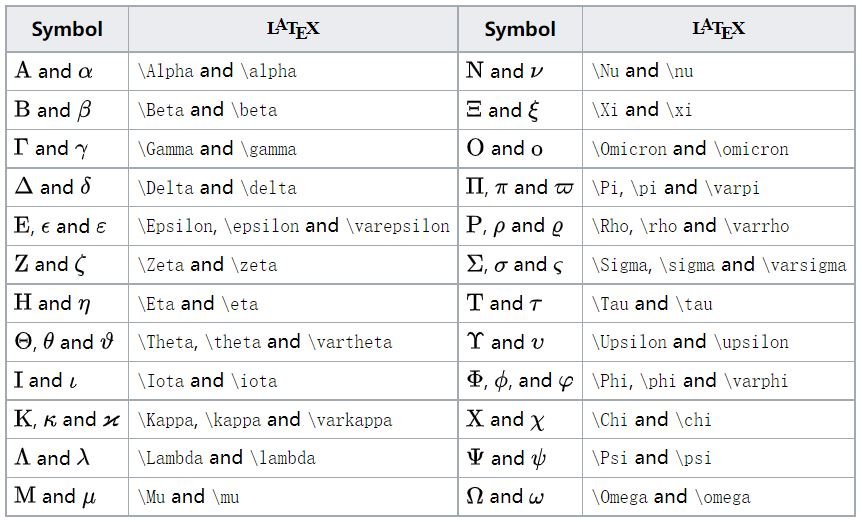

# INSTANT NOTES ON MARKDOWN
---
[TOC]

## 1. Hello, world!
What is *Lorem Ipsum*?

**Lorem Ipsum** is simply dummy text of the printing and  typesetting industry. Lorem Ipsum has been the industry's  standard dummy text ever since the 1500s, when an unknown  printer took ~~a galley of type~~ and scrambled it to make a  type specimen book. It has survived not only five centuries, but also the leap into electronic typesetting,  remaining essentially unchanged. 

It was ==popularised in the 1960s== with the release of etraset sheets containing Lorem Ipsum passages, and more recently with desktop publishing software like Aldus PageMaker including versions of Lorem Ipsum.

## 2. Mathematical formula
Some examples of mathematical formula:

$$\int_{-\infty}^{\infty} e^{-x^2} = \sqrt{\pi} \tag{2.1}$$

$$f(x) = sin(x) + 12 \tag{2.2}$$

$$e^{i\theta} = sin(\theta) + icos(\theta) \tag{2.3}$$

$$\displaystyle\frac{x-1}{x+1} \tag{2.4}$$

$$\displaystyle\sum_i^nn^2 \tag{2.5}$$

$$
\begin{aligned}
y &=(x+5)^2-(x+1)^2 \\
&=(x^2+10x+25)-(x^2+2x+1) \\
&=8x+24 \\
\end{aligned}
\tag{2.7}
$$

$$
\begin{cases}
k_{11}x_1 + k_{12}x_1 + \cdots + k_{1n}x_1 = b_1 \\
k_{21}x_1 + k_{22}x_1 + \cdots + k_{2n}x_1 = b_2 \\
\cdots \\
k_{n1}x_1 + k_{n2}x_1 + \cdots + k_{nn}x_1 = b_n \\
\end{cases}
\tag{2.8}
$$

$$
\begin{bmatrix}
1 & 1 & \cdots & 1 \\
1 & 1 & \cdots & 1 \\
\vdots & \vdots & \ddots & \vdots \\
1 & 1 & \cdots & 1 \\
\end{bmatrix}
\tag{2.9}
$$

For more information on mathematical formula, see: https://oeis.org/wiki/List_of_LaTeX_mathematical_symbols

## 3. Figures
Below is a table for using math letters with markdown:


Method to resize a figure:


## 4. Table
左对齐|居中|右对齐
:--|:--:|--:
2|3|5
10|100|1000
$e^i$|${\pi}$|$x^2$

## 5. Quote
> "Imagination is more important than knowledge"
> by Albert Einstein

## 6. Code blocks
``` python (cmd = true)
print("Hello world!")
```
```javascript {.line-numbers}
function add(x, y){
    return x + y
}
```

## 7. References
Official documents: https://shd101wyy.github.io/markdown-preview-enhanced/#/
Markdown学习笔记: https://orangex4.cool/post/notes-in-markdown/