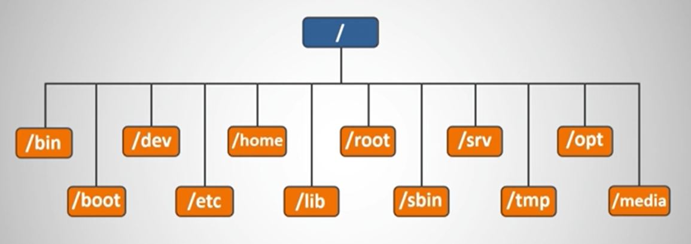
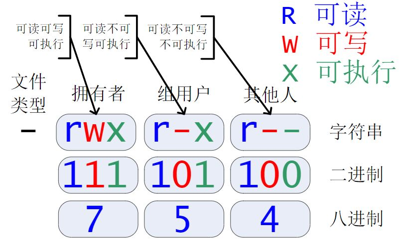
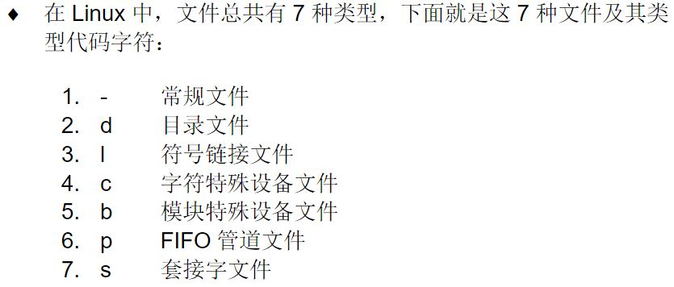
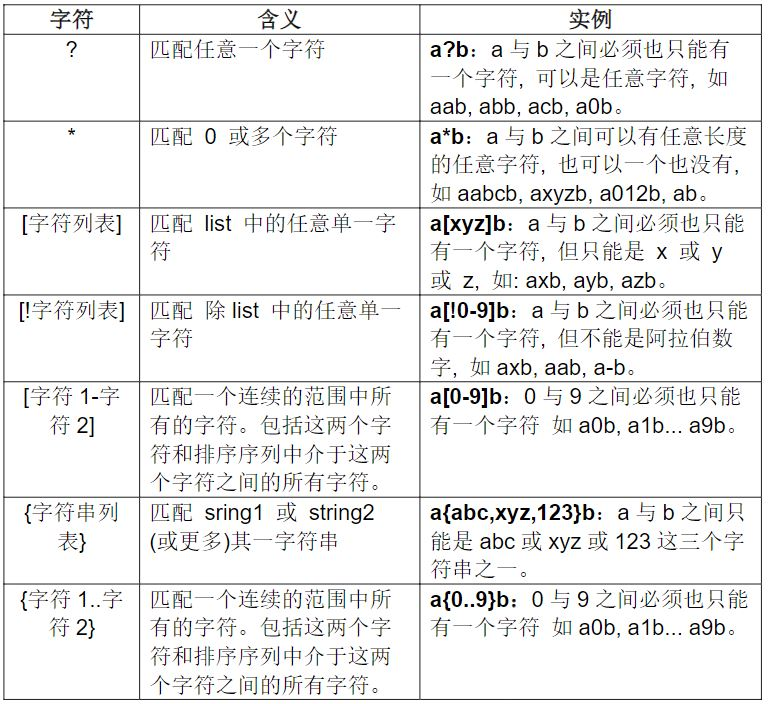
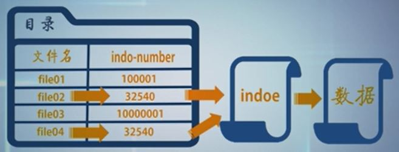
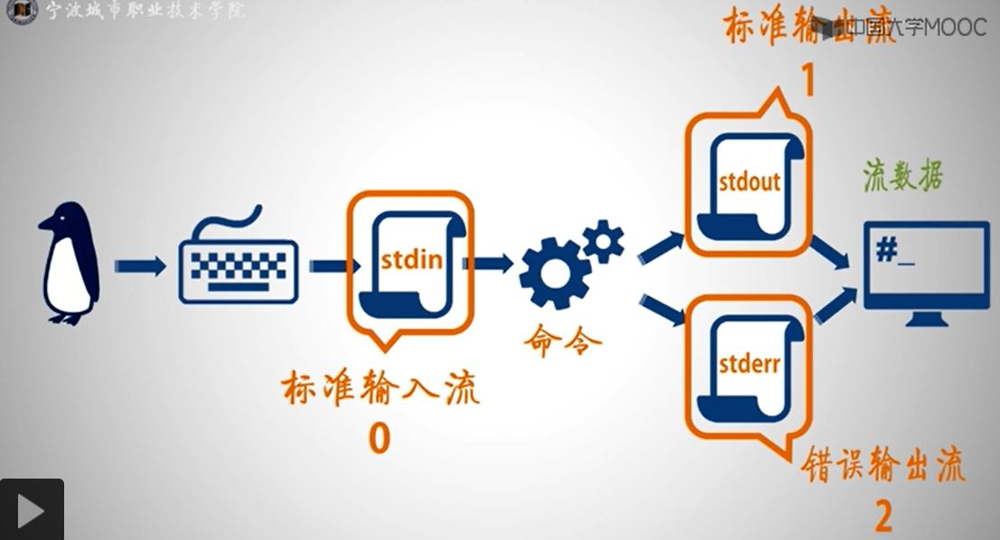
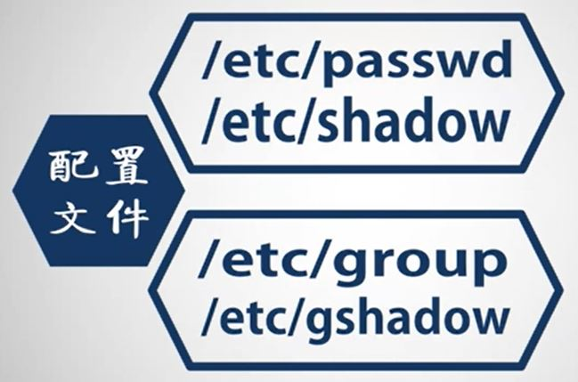

# INSTANT NOTES ON LINUX
[TOC]

## 1. About Linux
* Linux与UNIX
>1991年8月, 芬兰赫尔辛基大学的学生Linus Torvalds以Minix为蓝本开发了一套兼容80386处理器的操作系统内核, 即Linux 0.0.1版。目前内核最新版本为3.3.2版。

* Linux与GNU Project
>1983年著名黑客Richard M. Stallman发起GNU Project（自由软件运动）。GNU Project致力于开发一个自由并且完整的类UNIX操作系统，包括软件开发工具和各种应用程序。其内核GNU Hurd没有充分吸引开发者。Linux内核的发布与GNU结合就诞生了Linux操作系统。

* Linux内核与外壳


* Linux发行版
> 1. Red Hat Enterprise Linux (RHEL)
> 2. SUSE
> 3. Ubuntu
> 4. CentOS
> 5. Debian GNU/Linux

## 2. VIM
```
----------moving cursor---------------------------------------
hjkl              --- Moving cursor
[n]<h,j,k,l>      --- moving n <h,j,k,l>
0                 --- move the cursor to the start of the line
$                 --- go to the end of the line
[n]$              --- go to the end of the [n]-th line
G                 --- move to the bottom of the file
gg                --- move to the start of the file
[n]G              --- move to number [n] of the file
w                 --- move to the start of the next word
W                 --- move to the start of the next WORD
b                 --- move backwards
B                 --- move backwards of WORD
e                 --- move to the end of the next word
[n]w              --- move to the start of the next [n] word
[n]e              --- move to the start of the next [n] word
f[x]              --- find and jump to the next [x]
f[x];;            --- find and jump to the next [x], and the next, and the next
ctrl-d            --- move half page down
ctrl-u            --- move half page up
}                 --- jumps entire paragraphs downwards
{                 --- jumps entire paragraphs upwards

----------copy and paste---------------------------------------
yy                --- copy (yank) the line
[n]yy             --- copy n lines below
v                 --- start visual selection by moving cursor around
ctrl-v            --- visual block mode
y                 --- copy (yank) the content selected by visual selection\
yw                --- yank a word
y[n]w             --- yank [n] words
p                 --- paste (put) below or after cursor
P                 --- paste above or before cursor

----------search and substitute--------------------------------
/[x]              --- search [x]
                  --- Press <n> goes forwards and <N> backwards
/[x]\c            --- search [x] in case insensitive mode only once
?[x]              --- search [x] backwards
ctrl-o            --- go back to where you came from
%                 --- find a matching ),], or }
:s/old/new        --- substitute old with new
:s/old/new/g      --- substitute old with new globally
:#,#s/old/new/g   --- substitute old with new in between #, # line
:1,$s/old/new/g   --- substitute old with new in the whole file
:%s/old/new/g     --- substitute old with new in the whole file
:%s/old/new/gc    --- substitute old with new in the whole file with a requesting prompt

----------delete-----------------------------------------------
dw                --- deleting until the start of the next word
de                --- deleting to the end of the current word
d$                --- deleting to the end of the line
d2w               --- deleting until the start of the two words
di"               --- delete in ""
dd                --- deleting the line
2dd               --- deleting two lines

----------commands---------------------------------------------
:q!               --- exiting VIM without saving
:wq               --- exiting VIM with saving
x                 --- deleting single letter
[n]x              --- deleting [n] letters
i                 --- insert before the letter
a                 --- append after the letter
A                 --- append after the line
r[x]              --- replace with [x]
R                 --- replace multiple letters
ce                --- change until the end of a word
c$                --- change to the end of the line
cw                --- change until the start of the next word
ci"               --- change in ""
ciw               --- change in word
u                 --- undo the previous action
ctrl-r            --- redo the previous action
U                 --- undo all the changes on a line
:e!               --- undo all changes in the file
ctrl-g            --- show your location in the file and the file status
ctrl-o            --- go back to where you came from
ctrl-v            --- visual block mode
ctrl-r            --- redo the previous action

:!<cmd>           --- excute an external command <cmd>
:w FILENAME       --- save file as FILENAME in the directory
v                 --- start visual selection by moving cursor around
:r FILENAME       --- read and put text file in the openning file
:r !ls            --- read and put the output of command
o                 --- open a new line BELOW the cursor
O                 --- open a new line ABOVE the cursor

----------set env----------------------------------------------
:set ic           --- ignore case option
:set nu           --- set line number
:set hls          --- set highligth search
:set is           --- show partial matches for a search phrase
:set nocp         --- VIM not in compatible mode
:set all          --- view all setting parameters in VIM

:e ~/.vimrc       --- edit vimrc file
:r $VIMRUNTIME/vimrc_example.vim        --- read example vimrc file
:w                --- save the file

----------record and play--------------------------------------
q[a-z]            --- start to record in register [a-z]
q                 --- stop recording
[n]@[a-z]         --- repeat [n] numbers of action in register [a-z]

----------open multiple windows--------------------------------
:sp FILENAME      --- open FILENAME in a horizontal split window
res+[n]           --- increase window size with [n] lines
res+[n]           --- decrease window size with [n] lines
:vsp FILENAME     --- open FILENAME in a vertical split window
vertical res+[n]  --- increase vertical window size with [n] lines
vertical res-[n]  --- decrease vertical window size with [n] lines
ctrl-w-<h,j,k,l>  --- jump between different windows

:tabedit FILENAME --- open FILENAME in a new tab-window
[n]gt             --- switch to [n]-th tab-window
```

## 3. File management
* Linux文件树

```
/                        --- root
/bin                     --- binary file
/boot                    --- boot file
/dev                     --- device file
/etc                     --- 配置文件
/home                    --- home directory
/lib                     --- 库文件
/root                    --- root home directory
/sbin                    --- root binary file
/srv                     --- data file
/tmp                     --- temporary file
/opt                     --- software install file 
/media                   --- USB, CD file
```

* 列出文件及属性


```
$ ls -l                  --- 列出文件及属性
类型和权限|连接数|拥有者|文件组|大小|被修改时间|文件名
drwxr-xr-x. 2 felix felix    40 Nov 21 05:41 Desktop
drwxr-xr-x. 5 felix felix    80 Dec 23 19:45 Documents
drwxr-xr-x. 2 felix felix     6 Nov 21 05:33 Downloads
-rwxrwxrwx. 1 root  root  17047 Jan  6 01:12 messages.bak
-rw-rw-r--. 1 felix felix 16892 Jan  6 01:13 messages.bak01
-rw-rw-r--. 1 felix felix 16991 Jan  6 01:14 messages.bak02
drwxr-xr-x. 2 felix felix     6 Nov 21 05:33 Music

$ chmod 777 [file]   --- change file permission to 777
$ chown [user:group] [file]     --- change owner and group of file
```

* 切换、创建与删除目录
```
$ cd [directory]         --- change directory
$ cd -                   --- change to previous directory
$ cd ..                  --- change to upper level directory 
$ cd ~                   --- change to home directory
$ mkdir [directory]      --- make directory
$ mkdir -p [dir/dir]     --- make multiple directory
$ rmdir [directory]      --- remove directory 只能删除空目录
```

* 拷贝、剪切和删除
```
$ cp [file01] [file02]   --- copy file01 to file02 (and rename when necessary)
$ cp [f01] [f02] [dir]   --- copy multiple file [f01] [f02] to directory [dir]
$ cp -r [dir01] [dir]    --- copy directory [dir01] to directory [dir]
$ \cp -f [dir01] [dir]   --- 强制复制并且覆盖
$ cp -p [dir01] [dir]    --- 拷贝但不发生文件属性改变

$ mv [file01] [dir]      --- 移动文件file01到dir
$ mv -f [file01] [dir]   --- 强制复制并且覆盖
$ mv [name01] [name02]   --- 同路径下可以实现重命名

$ rm [file01]            --- delete file01
$ rm [f01] [f02]         --- delete multiple files
$ rm -R [dir]            --- delete directory
$ rm -Rf [dir]           --- 不询问删除目录

$ touch [file]           --- 创建文件，如file已存在，则会修改其时间戳属性
```

* 通配符

```
$ rm -f /tmp/*.txt
$ cp /tmp/file[0-9].txt ~
$ chmod 700 /tmp/scripts[a,1,x].sh
$ rm -rf {jiaoben,script}*.sh
$ tar -cf file.tar /tmp/file[!0-9].txt
```

* 压缩与解压缩文件
```
$ tar -cf f.tar f01 f02        --- create f.tar to pack file f01, f02, etc
                               --- -c create file
                               --- -f file name
                               --- -v verbose
$ tar -tf f.tar                --- list all files in f.tar
$ tar -f f.tar --delete f01    --- delete f01 from f.tar
$ tar -f f.tar -A f01.tar      --- combine f01.tar to f.tar
$ tar -f f.tar -r f01          --- add file f01 to f.tar
$ tar -xf f.tar                --- extract f.tar
$ tar -xf f.tar -C [dir]       --- extract f.tar in [dir]
$ tar -czf f.tar.gz f01 f02    --- create and compress f01, f02 to f.tar.gz
$ tar -xzf f.tar.gz            --- extract and decompress f.tar.gz

$ gzip f.tar                   --- compress f.tar (will create a .gz file)
$ gzip f.tar.gz                --- decompress f.tar.gz
$ gzip -[1-9] f.tar            --- compress f.tar with compression ratio option
```

* 链接文件

==每个文件只有一个inode number==
==两个文件不可能拥有相同的inode number==


==删除硬链接不会删除原文件, 可以通过其他硬链接访问文件（狡兔三窟）==
==不能跨硬盘分区创建硬链接==
```
$ ls -il [file]                            --- display inode number of file
$ ln -s [file] [name]                      --- create a symbolic link [name] to [file]
$ ln -s /tmp/hello.sh ./hello.slink
$ ls -il
922039 -rw-rw-r- 1 user user 20 Jul 28 00:45 hello.slink --> /tmp/hello.sh

$ ln [file] [name]                         --- create a hard link [name] to [file]
$ ln /tmp/sample.txt ./sample.hl01
$ ls -il /tmp/sample.txt ./sample.hl01
922039 -rw-rw-r- 2 user user 20 Jul 28 00:45 /tmp/sample.txt 
922039 -rw-rw-r- 2 user user 20 Jul 28 00:45 ./sample.hl01
```

* 查看文本文件
```
$ cat [file]                        --- display file
$ less [file]                       --- use UP and DOWN to move
                                    --- use PAGEUP and PAGEDOWN to move between pages
                                    --- /[KEY] to search [KEY], use n and N to move to next [KEY]
                                    --- q for quit
$ head [file]                       --- display the first (default 10 lines) in file                                    
$ head -n 20 [file]                 --- display the first 20 lines in file
$ tail [file]                       --- display the bottom of file
```

* 查找文件
```
$ locate [path] **                  --- find file with '**' in path
                                    --- locate finds file in a database /var/lib/mlocate
$ updatedb                          --- update database /var/lib/mlocate (CAUTION: may take a while)
$ find [dir] [condition] [action]
$ find / -name passwd               --- find filename==passwd in directory /
$ find /bin -type l                 --- find filetype as link file in /bin
$ find /tmp -mtime -3 -ls           --- find and list file modified within 3 days in /tmp
$ find /tmp -mtime +7 -ls           --- find and list file modified before 7 days in /tmp
$ find /tmp -mtime 4 -ls            --- find and list file modified at exactly 4 days before in /tmp
                                    --- -mmin modified in minitues
                                    --- -amin file read or excuted in minitues
                                    --- -atime file read or excuted in days
                                    --- -ctime/cmin file attributes modified in days/miniutes
$ find /tmp -size -3k -ls           --- find and list file size smaller than 3k bytes
$ find /tmp -size +100c -ls         --- find and list file size larger than 100 bytes
$ find /tmp -size 10M -ls           --- find and list file size exactly equals to 10M bytes
                                    --- c 字节
                                    --- k 1024字节
                                    --- M 1024k
                                    --- G 1024M
$ find /tmp -user root -ls
$ find /tmp -uid 500 -ls
$ find /tmp -group stu -ls
$ find /tmp -gid 0 -ls
$ find /tmp -perm 754 -ls           --- search with permission option
$ find /tmp \(-size +1k -a -size -10M -a -mmin -30 -a -type -f\) -ls         --- search combination
                                    --- -a and
                                    --- -o or
                                    --- ! not
                                    --- -exec execute bash commands
                                    --- -OK similar to -exec but will ask user before action
$ find /tmp \(-size +1k -a -size -10M -a -mmin -30 -a -type -f\) -exec rm -rf {} \;
$ find /tmp \(-mmin -10 -a -type -d\) -exec tar -cf {}.tar {} \;
```


## 4. Pipe and redirection
> UNIX PHILOSOPHY
> Do one thing and do it well.
> --- Ken Thompson


* redirection
```
$ ls -l /tmp/example 1> ./stdout.txt       --- redirection stdout 1 to ./stdout.txt (will overwrite ./stdout.txt)
$ ls -l /tmp/example 1>> ./stdout.txt      --- redirection and append stdout 1 to ./stdout.txt
$ ls -l /tmp/example 1> ./stderr.txt       --- redirection and append stdout 2 to ./stderr.txt
$ ls -l /tmp/example 1> ./stdout.txt 2> ./stderr.txt
$ ls -l /tmp/example &> ./std.txt          --- redirection and append 1 and 2 to ./std.txt

$ ls -l /tmp/example/file01 2>> /dev/null  --- ignore error messages
                                           --- /dev/null is a black hole in linux
                                             
$ echo -e "1 apple\n2 banana\n3 pear" >> fruit.txt
$ tr ' ' '\t' < fruit.txt                  --- < input redirection
                                           --- tr [k1] [k2] replace k1 with k2
$ sort -k2 << EOF                          --- sort -k[n] sort by [n]-th character
> 1 apple                                  --- << input redirection
> 2 pear                                   --- EOF界定符, 首尾都要
> 3 banana
> EOF
1 apple
3 banana
2 pear
```
* pipe


```
$ grep [KEY] [FILE]                        --- search KEY in FILE
$ ls -al /etc | grep 'ssh'                 --- search file with ssh in /etc
$ cat ~/install.log | cut -c1,2            --- cut the first 2 column in file
$ cat /etc/passwd | cut -f1 -d":"          --- cut by ":" and display the first column
$ ls -al ~ | cut -c1 | grep "d" | wc -l    --- count directory file in ~
```

## 5. User management


* 查看用户
```
$ id [user]                                --- 查看用户user
$ id root                                  --- 查看root
$ finger [user]                            --- 查看用户user
```

* 切换用户
```
$ su -l [user]                             --- 切换到user用户
                                           --- -l 切换用户环境
$ su - [user]                              --- 切换用户及环境
$ su - root                                --- 切换root用户
$ su -                                     --- 切换root用户
```

* 创建修改删除用户

```
# useradd lecturer                         --- 创建lecturer用户
# passwd lecturer                          --- 设置lecturer用户密码
# useradd -c [comment] -u [UID] -d [HOME_DIR] -g [MAIN_GROUP] -G [OTHER_GROUP] -s [SHELL] [user]
# usermod -c [comment] -u [UID] -d [HOME_DIR] -g [MAIN_GROUP] -G [OTHER_GROUP] -s [SHELL] [user]
# userdel [user]                           --- 删除用户组
```

* 创建修改删除用户组
```
# groupadd [group]                         --- 创建group用户组
# groupadd -g [GID] [group]                --- 指定GID
# groupmod -g [GID] -n [GOURP_NAME] [group]
# groupdel [group]                         --- 删除用户组
```

* 让渡用户权限
```
# vim /etc/sudoers                         --- 设置配置sudoers文件
root    ALL=(ALL)         ALL
user    ALL=(ALL)         ALL              --- 添加一行使user列为sudoers

$ sudo -u root <action>                    --- 用sudo命令执行action
$ sudo <action>                            --- 用sudo命令执行action
```

* 用户配置文件

```
# vim /etc/passwd
用户名|密码|UID|GID|描述|家目录|shell名称
root:x:0:0:root:/root:/bin/bash
bin:x:1:1:bin:/bin:/sbin/nologin
daemon:x:2:2:daemon:/sbin:/sbin/nologin
adm:x:3:4:adm:/var/adm:/sbin/nologin
lp:x:4:7:lp:/var/spool/lpd:/sbin/nologin

# vim /etc/shadow
用户名|密码|1970-01-01计算的修改时间|两次修改密码之间的最小时间间隔（天）|两次修改密码之间的最大时间间隔（天）|密码失效警告时间|最长不活动时间|用户失效时间|保留字段
root:$6$Gcg6VxwQanfqFepm$iKiMYwIdP.KrZBfNbeG1bbDpSSfFeyg7XyLbzwYlOuwBlG33Or2L.UBHn0BP2O3zM7L52/LEMPsRNO/xizxLn1::0:99999:7:::
bin:*:17834:0:99999:7:::
daemon:*:17834:0:99999:7:::
adm:*:17834:0:99999:7:::
lp:*:17834:0:99999:7:::

# vim /etc/group
用户组名|用户组密码|GID|用户列表||
ot:x:0:
bin:x:1:
daemon:x:2:
sys:x:3:
adm:x:4:
tty:x:5:
disk:x:6:

# vim /etc/gshadow
用户组名|密码|组管理者|用户列表
root:::
bin:::
daemon:::
sys:::
adm:::
tty:::
disk:::
```

## 6. Device management
* 设备名命（==设备名不固定，热插拔可能改变设备名==）
```
/dev/sda          # SCSI, SATA, USB设备
/dev/sdb          # SCSI, SATA, USB设备
/dev/nvme1n1p3    # NVMe设备
/dev/sr0          # CD-ROM, DVD-ROM设备
```

* 设备分区名命规则（主分区用1-4表示，逻辑分区从5开始。）
```
/dev/sda1
/dev/sda2
/dev/nvme1n1p3
```

* 硬盘查看命令
```
$ fdisk -l

Disk /dev/sdb: xxx.xx GB, xxxx bytes
xxx heads, xx sectors/track, xx cylinders
Units = xxx
Sector size : xxx
I/O size : xxx
Disk identifier : xxx

Device     Boot Start   End Blocks  Id System
/dev/sda1         xx     xx  xxxx   82 Linux Swap / Solaris
/dev/sda2    *    xx     xx  xxxx   83 Linux
```

* 硬盘分区
```
fdisk     --- 交互式分区（使用MSDOS分区表，适用于硬盘小于2.2 TB）
parted    --- 交互式/非交互式分区（使用MSDOS/GPT分区表，适用于硬盘大于2.2 TB）
```

* 创建文件系统
```
mkswap     --- 创建交换分区文件系统
mkfs       --- 创建文件系统
```

* 手动挂载/卸载
```
mount -t [分区类型] -o [挂载属性] [分区名] [挂载点]      --- 挂载
umount [设备名/目录]                                    --- 卸载
```

* 自动挂载（手动修改 /etc/fstab 配置文件）
```
# vim /etc/fstab

设备名        挂载点          文件系统类型    挂载参数     dump参数    开机检查分区顺序
UUID=xxxxx    /dev/xxx       devpts         defaults      0           0
UUID=xxxxx    /dev/xxx       swap           defaults      0           0
/dev/sdb1     /dev/project   ext4           defaults      0           0    
```

## 7. Network management (ethernet)
* ifconfig查看、操作网络接口（即网卡）
```
$ ifconfig                 --- 查看网络接口
ens33: flags=4163<UP,BROADCAST,RUNNING,MULTICAST>  mtu 1500
        ether 00:0c:29:98:a5:dc  txqueuelen 1000  (Ethernet)
        RX packets 823  bytes 75062 (73.3 KiB)
        RX errors 0  dropped 0  overruns 0  frame 0
        TX packets 0  bytes 0 (0.0 B)
        TX errors 0  dropped 0 overruns 0  carrier 0  collisions 0
lo: flags=73<UP,LOOPBACK,RUNNING>  mtu 65536
        inet 127.0.0.1  netmask 255.0.0.0
        inet6 ::1  prefixlen 128  scopeid 0x10<host>
        loop  txqueuelen 1000  (Local Loopback)
        RX packets 1420  bytes 121324 (118.4 KiB)
        RX errors 0  dropped 0  overruns 0  frame 0
        TX packets 1420  bytes 121324 (118.4 KiB)
        TX errors 0  dropped 0 overruns 0  carrier 0  collisions 0

$ ifconfig ens33                                             --- 查看ens33接口
$ ifconfig -a                                                --- 查看所有接口
$ ifconfig ens33 up                                          --- 开启ens33接口
$ ifconfig ens33 192.168.16.125 netmask 255.255.255.0        --- 配置ens33接口
$ ifconfig ens33 mtu 5000                                    --- 配置ens33的MTU
$ ifconfig ens33 down                                        --- 关闭ens33接口
```

* Network Manager查看、操作网络接口（即网卡）
```
$ yum list NetworkManager              --- 查看NM是否安装
$ systemctl status NetworkManager      --- 查看NM是否启动
$ systemctl start NetworkManager       --- 启动NM
$ systemctl enable NetworkManager      --- 开机自启动NM

$ nmcli device status                  --- 查看主机网络接口状态
DEVICE      TYPE      STATE         CONNECTION 
virbr0      bridge    connected     virbr0     
ens33       ethernet  disconnected  --         
lo          loopback  unmanaged     --         
virbr0-nic  tun       unmanaged     --

$ nmcli device show ens33              --- 查看ens33接口的详细信息
$ nmcli connection show ens33          --- 查看NM为ens33接口连接配置的详细信息
```

* 一致网络设备命名（CentOS 7+）
```
ens33      --- en表示以太网
           --- s表示PCIe插槽slot
           --- 33表示插槽索引号
```

* 配置网络参数
```
$ cd /etc/sysconfig/network-scripts/          --- 切换到网络配置参数文件的目录
# vim ./ifcfg-ens33                           --- 配置ens33网卡
TYPE=Ethernet
PROXY_METHOD=none
BROWSER_ONLY=no
BOOTPROTO=dhcp                                --- 可修改为static
DEFROUTE=yes
IPV4_FAILURE_FATAL=no
IPV6INIT=yes
IPV6_AUTOCONF=yes
IPV6_DEFROUTE=yes
IPV6_FAILURE_FATAL=no
IPV6_ADDR_GEN_MODE=stable-privacy
NAME=ens33
UUID=efb6dfbb-6c04-4e8d-a028-af8548611818
DEVICE=ens33
ONBOOT=no
IPADDR=192.168.xxx.xxx                        --- 指定IP地址
GATEWAY=192.168.xxx.xxx                       --- 指定网关（一台机器网关只有一个，不需要多次配置）
NETMAS=255.255.255.0                          --- 子网掩码
DNS1=xxx.xx.x.x                               --- DNS服务器IP地址

# service network restart                     --- 重启网络使命令生效
$ ping -c [次数] [网关IP地址]                  --- 查看是否接通网关

# vim /etc/sysconfig/network                  --- 设置主机名
NETWORKING=yes
HOSTNAME=localhost.localdomain                --- 设置主机名

# vim /etc/hosts                              --- 设置hosts文件
127.0.0.1   localhost localhost.localdomain localhost4 localhost4.localdomain4
::1         localhost localhost.localdomain localhost6 localhost6.localdomain6
[本机IP地址]  [对应主机名]                     --- 设置hosts文件

# ping [主机IP]                               --- 查看是否接通
# service network restart                     --- 重启网络使命令生效
```

* 用Network Manager配置网络
```
# nmcli connection add type ethernet con-name sample-con ifname ens33     --- 建立ethernet连接，设置连接名，绑定设备
# nmcli connection modify sample-con ipv4.address xx.xx.xx.xx/xx          --- IP地址
# nmcli connection modify sample-con ipv4.gateway xx.xx.xx.xx             --- 网关
# nmcli connection modify sample-con ipv4.method manual                   --- 静态配置
# nmcli connection up sample-con                                          --- 启动连接
```

* 修改主机名
```
# nmcli general hostname                       --- 查看主机名
# nmcli general hostname [新主机名]             --- 修改为新主机名
# systemctl restart systemd-hostnamed          --- 使修改主机名生效
```

## 8. Application management
* rpm软件包名命
软件名|<----版本号--->|架构（noarch表示任意架构可安装）
tsclient-2.0.2-10.el6.x86_64.rpm

* rpm软件管理
```
$ rpm -q xxx                 --- 查询xxx是否安装
$ rpm -ivh xxx.rpm           --- 安装
$ rpm -e xxx.rpm             --- 卸载
```

* yum软件管理
```
# yum clean all              --- 清除yum原有软件包缓存数据
# yum makecache              --- 将服务器上软件包相关信息保存到本地
# yum install xxx            --- 安装xxx软件
# yum list xxx               --- 查询xxx是否已安装, 支持通配符
# yum list installed         --- 主机上已安装的软件包
# yum list available         --- 可安装的软件包
# yum info xxx               --- 查看xxx软件具体信息
# yum update xxx             --- 更新xxx软件
# yum remove xxx             --- 删除xxx软件
```

* 配置yum软件源
```
# ls /etc/yum.repos.d                      --- 列出软件源配置文件
# /etc/yum.repos.d/rpmforge.repo           --- RepoForge软件源配置文件
# yum install yum-plugin-priorities        --- 优先级配置插件
# vim /etc/yum.repos.d/CentOS-Base.repo    --- 修改官方源priority=1
# vim /etc/yum.repos.d/rpmforge.repo       --- 修改RepoForge软件源priority=10
```

## 9. Process and service management
* 程序与进程
程序 = 菜谱
进程 = 烹饪过程（运行中的程序）

* 查看进程
```
$ ps -A                      --- 列出系统中所有的进程（进程查看, process status）

进程号|占用的终端（?表示不占用终端）|进程运行持续时间|进程对应的程序名
PID    TTY                         TIME            CMD
1      ?                           00:00:01        init
6546   pts/0                       00:00:00        bash

$ ps -Af                     --- 列出系统中所有的进程（进程查看, process status）

进程由哪个用户运行|进程号|父进程的PID|占用CPU资源的比例|进程开始时间|占用的终端（?表示不占用终端）|进程运行持续时间|进程对应的程序名
UID               PID    PPID        C                STIME        TTY                         TIME            CMD
root              2      0           0                Dec29        ?                           00:00:00        [kthreadd]
root              4      2           0                Dec29        ?                           00:00:00        [kworker/0:0H]
root              6      2           0                Dec29        ?                           00:00:00        [ksoftirqd/0]
root              7      2           0                Dec29        ?                           00:00:00        [migration/0]
root              7877   2           0                01:11        ?                           00:00:00        [kworker/2:2]
root              7963   2           0                01:16        ?                           00:00:00        [kworker/2:1]

$ kill xxx                   --- 结束xxx（PID）进程
$ ps -Af | less              --- 与管道结合
$ ps -Al                     --- 列出更完整信息
$ top                        --- 动态监视命令（==默认每3秒更新一次==）

PID  USER      PR   NI  VIRT    RES     SMR    S   %CPU %MEM  TIME+   COMMAND
1717 root      20   0   388128  78976   47716  S   2.0  1.0   0:19.01 X
3357 felix     20   0   3851352 213800  76212  S   1.7  2.6   1:05.14 gnome-shell
6480 felix     20   0   765216  37292   17880  S   1.3  0.5   0:06.77 gnome-terminal-
1007 root      20   0   90564   3188    2328   S   0.3  0.0   0:03.65 rngd
```

* 操控进程
```
# kill [PID]                 --- 结束PID进程
# kill -9 [PID]              --- 强制结束PID进程
# pkill xxx                  --- 结束进程名为xxx的进程
# pkill -u xxx               --- 结束用户名xxx的所有进程
# xkill                      --- 图形界面kill
```

* 查看和操作服务（daemons）
```
# chkconfig --list | grep httpd                      --- 查看阿帕奇守护进程（daemon）httpd是否存在
# service httpd status                               --- 查看httpd运行状态
# service httpd start                                --- 启动httpd
# service httpd restart                              --- 重启httpd
# chkconfig --level 35 httpd on                      --- 设置httpd开机启动

# systemctl start httpd                              --- 启动阿帕奇守护进程（daemon）服务
# systemctl status httpd                             --- 查看httpd运行状态
# systemctl enable httpd                             --- 设置开机启动
# systemctl stop httpd                               --- 停止服务
# systemctl restart httpd                            --- 重启服务
# systemctl disable httpd                            --- 取消开机启动
# systemctl status firewalld                         --- 查看防火墙daemon服务
# firewall-cmd --add-service http --permanent        --- 添加http服务, 即开启80端口, permanent表示永久生效
```

## 10. Remote login to a Linux server
* 开启ssh服务
```
# yum list installed | grep ssh                      --- 查看openssh是否安装
# service sshd status                                --- 查看sshd是否启动
# chkconfig --list sshd                              --- 查看sshd是否开机自启动
# chkconfig --level 35 sshd on                       --- 设置sshd开机启动
```

* 设置ssh安全性
```
# vim /etc/ssh/sshd_config                           --- 设置sshd安全性

PermitRootLogin no                                   --- 设置sshd安全性
PermitEmptyPasswords no                              --- 设置sshd安全性
ClientAliveInterval 30                               --- 设置sshd安全性（30s无动作）
ClientAliveCountMax 4                                --- 设置sshd安全性（连续4次无动作）
```

* 配置SSH服务器密钥认证登录
```
# vim /etc/ssh/sshd_config                           --- 设置sshd安全性
PasswordAuthentication no                            --- 设置密码验证no

# service sshd restart                               --- 重启sshd生效

$ ssh-keygen -t rsa                                  --- 建立密钥
$ cd ~/.ssh                                          --- 确认私钥与公钥已生成
$ cat ./id_rsa.pub >> authorized_keys                --- 将公钥放入指定的authorized_keys文件
$ rm ./id_rsa.pub                                    --- 删除公钥文件
$ chmod 400 authorized_keys                          --- 修改公钥读写属性为400
```
将私钥id_rsa以安全方式分发给用户。用户用puttygen.exe转换私钥。

## 12. References
MOOC课程《Linux系统管理》：https://www.icourse163.org/course/NBCC-437004
《鸟哥的Linux私房菜》：http://linux.vbird.org/linux_basic/
菜鸟教程《Linux教程》：https://www.runoob.com/linux/linux-tutorial.html
